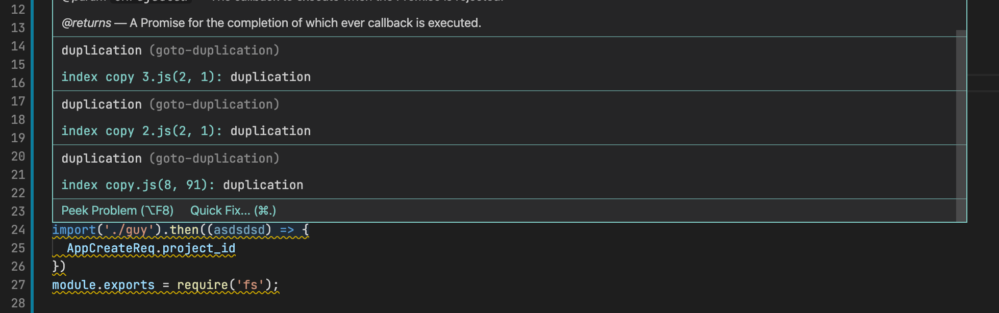
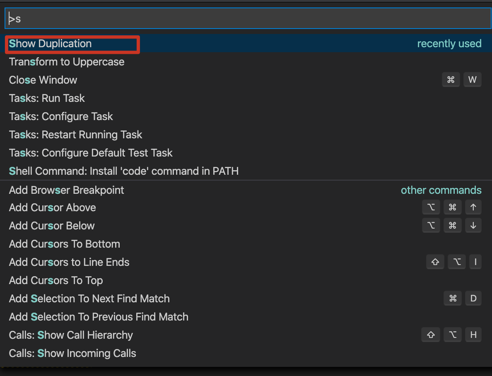
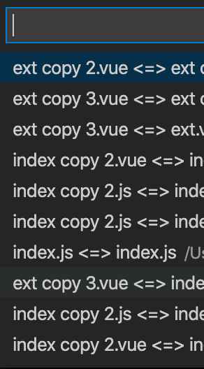
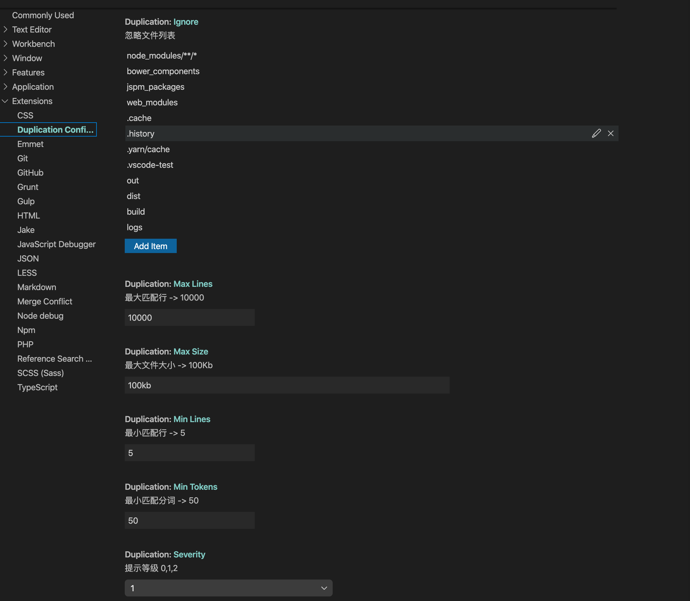

# vscode duplication  重复代码检查
> 提示 重复 代码片段






### 支持配置
```ts
{
  "duplication.ignore": {
    "type": "array",
    "default": [
      "node_modules/**/*",
      "bower_components",
      "jspm_packages",
      "web_modules",
      ".cache",
      ".history",
      ".yarn/cache",
      ".vscode-test",
      "out",
      "dist",
      "build",
      "logs"
    ],
    "items": {
      "type": "string"
    },
    "description": "忽略文件列表",
    "scope": "window"
  },
  "duplication.minTokens": {
    "type": "number",
    "default": 50,
    "description": "最小匹配分词 -> 50",
    "scope": "window"
  },
  "duplication.maxLines": {
    "type": "number",
    "default": 10000,
    "description": "最大匹配行 -> 10000",
    "scope": "window"
  },
  "duplication.minLines": {
    "type": "number",
    "default": 5,
    "description": "最小匹配行 -> 5",
    "scope": "window"
  },
  "duplication.maxSize": {
    "type": "string",
    "default": "100kb",
    "description": "最大文件大小 -> 100Kb",
    "scope": "window"
  },
  "duplication.debug": {
    "type": "boolean",
    "default": false,
    "description": "debug",
    "scope": "window"
  },
  "duplication.severity": {
    "type": "number",
    "enum": [
      0,
      1,
      2
    ],
    "default": 1,
    "description": "提示等级 0,1,2",
    "scope": "window"
  },
  "duplication.formatsExts": {
    "type": "object",
    "additionalProperties": {
      "type": "array",
      "items": {
        "type": "string"
      }
    },
    "description": "附加格式 -> [key: string]: string[]",
    "scope": "window"
  }
}
```